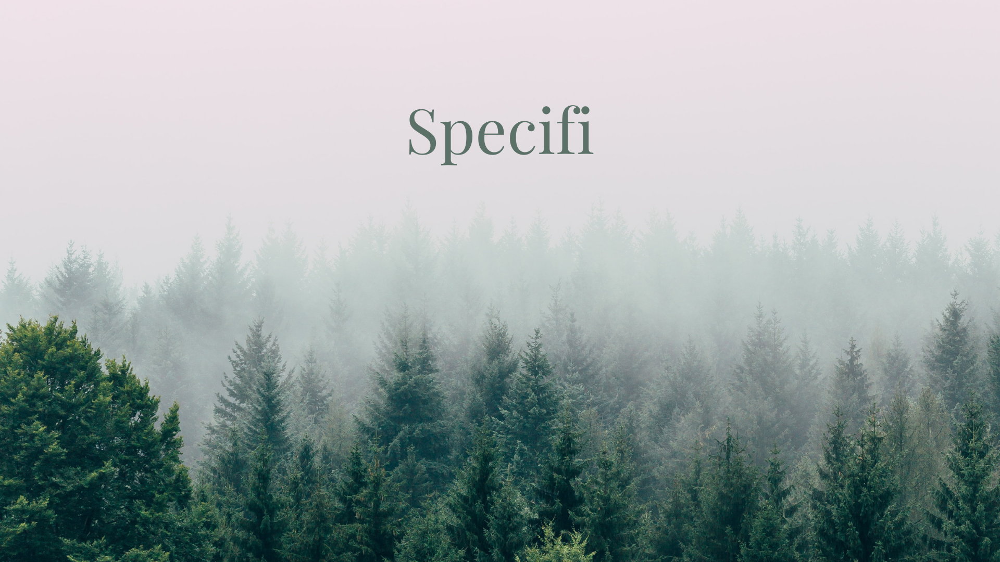

**Specifi** enables the community-based classification of images through a simple game. It is an accessibility-focused application for users with limited reading and writing capacity. It can be used across multiple users for the classification of images, specially designed for the classification of forest species.

## Prerequisites

1. Node 12
2. Android Studio and Android SDK
3. Java JRE JDK 11 (`sudo apt install default-jre default-jdk`)

I am assuming that we already have 104 files (100 images + 4 audio) with the following structure:

```
images
  ├── 1.jpg
  ├── 2.jpg
  ├── 3.jpg
  └── 4.jpg
  └── ...
  └── ...
  └── ...
  └── ...
  └── ...
  └── 97.jpg
  └── 98.jpg
  └── 99.jpg
  └── 100.jpg

recordings
  ├── orange.mp3
  ├── purple.mp3
  ├── rose.mp3
  └── yellow.mp3
```

## Process

- Download the GitHub repository as a ZIP. Unzip the contents.

- `cd Specifi`
- `npm install`

- Copy the 4 mp3 files to the `android/app/src/main/res/raw/*.mp3` folder.
- Copy the 100 jpg files to the `assets/images/*.jpg` folder.

- `cd android`
- `./gradlew assembleRelease` (The app will be built in `android/app/build/outputs/apk/release/app-release.apk`)

- Copy this app to the device and run it.

:white_check_mark:
