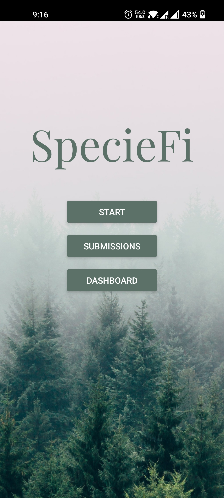

### What is SpecieFi?

Imagine you are an illiterate farmer owning 10 acres of forest land in a rural region of India, who has no idea about smartphones or modern technologies. How does one create a multi-layer neural network classifying forest species with the help of data supplied by these farmers?

Welcome, SpecieFi - a first-of-its-kind offline-first application that enables the community-based classification of images through a simple game. It is an accessibility-focused application for users with limited reading and writing capacity. It can be used across multiple users for the classification of images, specially designed for the classification of forest species.

### Installation

The APK for SpecieFi is hosted and maintained on Mediafire. Click on the Android icon to download the APK.

### Developer's Guide

1. Clone this repository from GitHub.
2. Run the following command in the terminal:

- `cd SpecieFi`

- `npm install`

3. Follow the Environment Setup from https://reactnative.dev/docs/environment-setup.
4. Run the following command in the terminal:

- `npm run android` to build the android app in debug mode with hot reload functionality.

- `npm run android-release` to build the android app in release mode.

### Walkthrough

The demo video [[LINK]](https://www.mediafire.com/file/8y55346me6dz2bk/SpecieFi_Demo.mp4/file) can be found on Mediafire alongside the demo files [[LINK]](https://www.mediafire.com/folder/a66a3ai7jaekw/demo-files).

1. You are greeted by a home screen with all the necessary buttons.

2. You load the images (MANDATORY) and the audio cues (OPTIONAL) by navigating to the Dashboard.

3. Now, you are ready to start the game! You enter your details and then the game starts.

4. In the game, you are asked to drag-and-drop the 4 colored boxes to the corresponding species as shown in the pictures in the grid above.

- The colors are chosen so that Protanopia and deuteranopia color blind people are able to distinguish the 4 colors.
- To promote accessibility, one can click on the rectangular boxes to hear the audio cues for every color before making their choice.

5. After completing the game, you are asked to download the results to the device.

6. One can access all the submissions via the Submissions screen.

